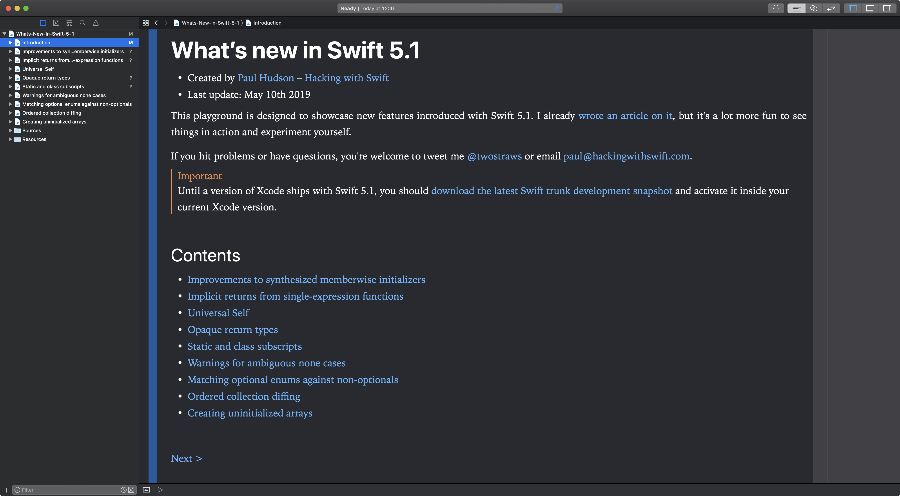

# What’s new in Swift 5.1?

This is an Xcode playground that demonstrates the new features introduced in Swift 5.1: 

* Improvements to synthesized memberwise initializers
* Implicit returns from single-expression functions
* Universal `Self`
* Opaque return types
* Static and class subscripts
* Warnings for ambiguous `none` cases
* Matching optional enums against non-optionals
* Ordered collection diffing
* Creating uninitialized arrays

This is designed to complement my existing article [What’s New in Swift 5.1](https://www.hackingwithswift.com/articles/182/whats-new-in-swift-5-1). You might also want to read [What’s New in Swift 5.0](https://www.hackingwithswift.com/articles/126/whats-new-in-swift-5.0) and [What’s New in Swift 4.2](https://www.hackingwithswift.com/articles/77/whats-new-in-swift-4-2). Alternatively, I have a whole website dedicated to tracking [what's new in Swift](https://www.whatsnewinswift.com) – you should check it out at <https://www.whatsnewinswift.com>.

If you hit problems or have questions, you're welcome to tweet me [@twostraws](https://twitter.com/twostraws) or email <paul@hackingwithswift.com>.

**Note:** Until a version of Xcode ships with Swift 5.1, you should [download the latest Swift trunk development snapshot](https://swift.org/download/) and activate it inside your current Xcode version.

